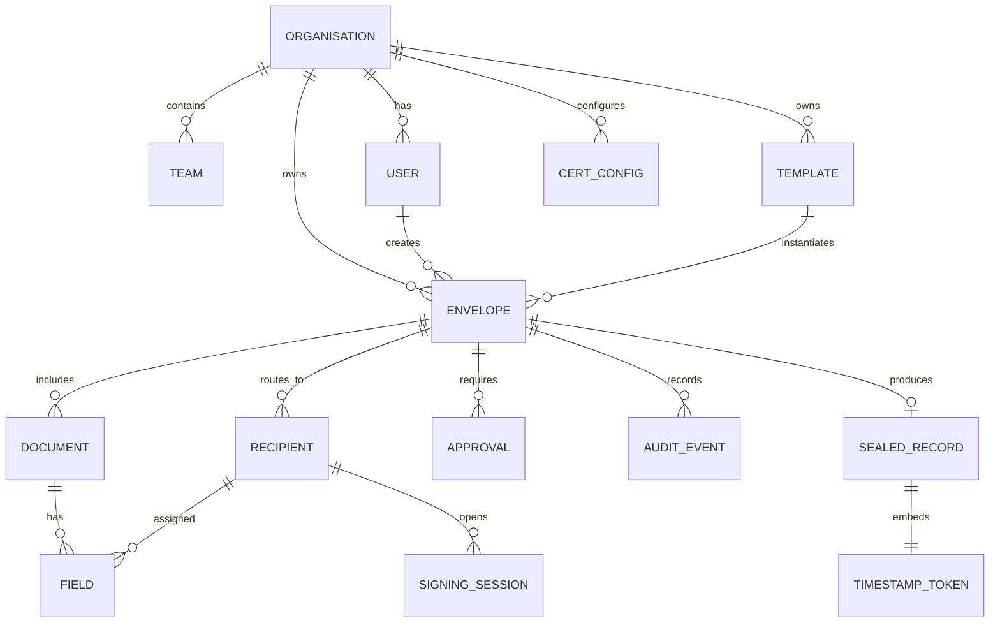

# Domain Model

> Source of truth: [Confluence — System Architecture §6](https://graphomy.atlassian.net/wiki/spaces/INK/pages/1081396) and [Database Design §3](https://graphomy.atlassian.net/wiki/spaces/INK/pages/753745)

## Entity Relationships



## Core Entities

| Entity              | Purpose                    | Key Notes                                                                         |
| ------------------- | -------------------------- | --------------------------------------------------------------------------------- |
| **Organisation**    | Tenant container           | Settings, subscription, compliance config. Every table carries `organisation_id`. |
| **User**            | Platform user              | Auth, profile, roles, permissions. OIDC/SAML integration.                         |
| **Template**        | Reusable document template | Pre-placed fields, usage tracking.                                                |
| **Envelope**        | Signing container          | Documents + fields + recipients + workflow state. Central unit of work.           |
| **Document**        | Agreement content          | File metadata, storage path, content type, form fields.                           |
| **Recipient**       | Signing participant        | Email, signing order, role (signer/approver/cc).                                  |
| **Field**           | Signature/form field       | Coordinates, type, assigned recipient.                                            |
| **Signing Session** | Single-use signer context  | Magic-link token hash, expiry, IP, user agent.                                    |
| **Signature**       | Cryptographic seal         | Type (draw/type/upload/digital), certificate, PAdES level.                        |
| **Certificate**     | Signing certificate        | Self-signed / DSC / AATL / Qualified. HSM integration.                            |
| **Cert Config**     | Per-org signing mode       | Self-signed / BYO / managed / QTSP-CSC.                                           |
| **Audit Event**     | Immutable action record    | Append-only, hash-chained (`prev_hash` → `row_hash`).                             |
| **Sealed Record**   | Completed sealed PDF       | PAdES B-LTA, RFC 3161 timestamp token.                                            |

## Workflow States

```
Draft → InReview → Approved → Sent → Completed
                                    → Declined
                                    → Voided
                                    → Expired
```

Any edit after `Approved` returns to `Draft` and invalidates approvals (required for 21 CFR Part 11).

## Key Design Rules

- Every table carries `organisation_id` — RLS enforces tenant isolation
- `AUDIT_EVENT` rows are append-only and hash-chained
- `SIGNING_SESSION` holds single-use magic-link token hash
- `CERT_CONFIG` records the signing mode per org
- UUIDs v7 for all IDs — never auto-increment
- Soft delete via `deleted_at` — never permanently delete business data
