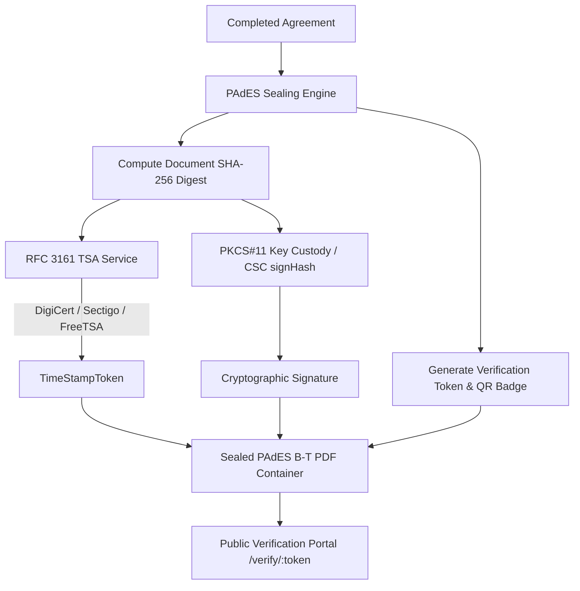

# Cryptographic Signing & Verification Subsystem

**graphsign.ink** implements an open-source, standards-compliant cryptographic signing infrastructure designed to guarantee document authenticity, non-repudiation, and long-term validity (LTV) across all signed agreements.

---

## 🏛️ Architecture & Security Model

The cryptographic trust core enforces three foundational rules:
1. **Isolated Key Custody**: Private keys are never exposed on application surfaces or logged. Key handles are operated via a PKCS#11-compliant custody boundary.
2. **PAdES Baseline Compliance**: Sealed documents adhere to ETSI EN 319 142 (PAdES B-T and B-LTA), embedding RFC 3161 timestamps and digital certificates directly into the PDF container.
3. **Independent Public Verification**: Any third party, auditor, or recipient can independently verify document authenticity, timestamp provenance, and tamper status without logging in.



---

## 🔑 1. Key Custody & Algorithm Support

The key custody service manages cryptographic keys behind a software/hardware PKCS#11 abstraction:

| Algorithm | Key Size / Curve | Use Case | Compliance |
| :--- | :--- | :--- | :--- |
| **RSA-2048** | 2048-bit modulus | Maximum compatibility with legacy PDF readers | NIST / FIPS / eIDAS |
| **RSA-4096** | 4096-bit modulus | High-security corporate sealing | NIST / eIDAS |
| **ECDSA-P256** | NIST P-256 (secp256r1) | Modern, compact signature structures | NSA Suite B / FIPS 186-4 |
| **ECDSA-P384** | NIST P-384 (secp384r1) | High-grade government & enterprise signing | Suite B High Security |

---

## 📜 2. Certificate Strategy: Self-Signed & BYO

Organizations can control their certificate strategy without paying recurring per-signature licensing fees:

### Option A: Automated Self-Signed Certificates (Free)
- One-click X.509 certificate generation directly inside the organization dashboard (`/settings/certificates`).
- **Custom Subject Identity & Credentials**:
  - **Common Name (CN)**: e.g. `Acme Corp Document Signing Authority`
  - **Organization (O)**: e.g. `Acme Corporation`
  - **Organizational Unit (OU)**: e.g. `Legal & Compliance`
  - **City / Locality (L)** & **State / Province (ST)**: e.g. `San Francisco, California`
  - **Country Code (C)**: ISO 2-letter code (e.g. `US`, `GB`, `IN`, `DE`)
  - **Signer Email**: e.g. `legal@acme.com`
- Embedded X.509 v3 Key Usage (`digitalSignature`, `nonRepudiation`) and Extended Key Usage (`id-kp-documentSigning`).
- Paired with free RFC 3161 trusted timestamps to prove exact signing time.

### Option B: Bring Your Own (BYO) Certificates
- Upload corporate commercial certificates (e.g. DigiCert AATL, GlobalSign, Sectigo, or Private Enterprise CAs).
- Supports full X.509 certificate chain (`chainPem`) to enable **PAdES B-LTA** (Long-Term Archive).
- Supports custom internal or dedicated TSA endpoints.

---

## ⏰ 3. RFC 3161 Time Stamp Authority (TSA) Failover

To guarantee timestamp reliability without single points of failure or subscription costs, graphsign.ink implements an automated failover chain:

| Priority | Provider | Endpoint URL | Protocol | Cost |
| :--- | :--- | :--- | :--- | :--- |
| **Primary** | DigiCert | `http://timestamp.digicert.com` | RFC 3161 (HTTP POST) | Free Public |
| **Fallback 1**| Sectigo | `http://timestamp.sectigo.com` | RFC 3161 (HTTP POST) | Free Public |
| **Fallback 2**| FreeTSA | `https://freetsa.org/tsr` | RFC 3161 (HTTPS POST) | Free Open Source |

### Query Construction
Requests are binary ASN.1 DER `TimeStampReq` structures containing:
- `MessageImprint`: SHA-256 hash algorithm OID (`2.16.840.1.101.3.4.2.1`) + document digest bytes.
- `nonce`: Cryptographically secure random 64-bit integer to prevent replay attacks.
- `certReq: true`: Requests the TSA certificate chain in the response to populate the trust store.

---

## 🔄 4. Dynamic Trust Store & Automated Certificate Rotation

TSA root and intermediate certificates rotate periodically (e.g., DigiCert rotates every ~15 months).

- **Automated Harvesting**: Whenever an RFC 3161 query returns with `certReq=true`, the returned certificate chain is extracted and upserted into the `TsaTrustEntry` database table.
- **Health Checks & Monitoring**: Daily automated cron probes all TSA endpoints, checking connectivity and flagging certificates expiring within **60 days** (`EXPIRING_SOON`).
- **Zero Downtime**: Timestamp verification validates historical documents against the certificate chain active at the time of sealing.

---

## 🌐 5. Cloud Signature Consortium (CSC v2.2) API

graphsign.ink implements the standard **CSC v2.2 Remote Signature API** at `/csc/v2/`:

- `POST /csc/v2/info`: Returns remote signing service metadata, supported algorithms, and OAuth modes.
- `POST /csc/v2/credentials/list`: Lists signing credentials available for the tenant.
- `POST /csc/v2/credentials/info`: Returns X.509 certificate details, algorithm, and certificate chain.
- `POST /csc/v2/credentials/authorize`: Generates short-lived Server Authorisation Data (`SAD`) tokens.
- `POST /csc/v2/signatures/signHash`: Signs one or more pre-computed hashes in batch.
- `POST /csc/v2/signatures/timestamp`: Issues RFC 3161 timestamp tokens for external document hashes.

---

## 🔍 6. Three-Tier Document Verification Portal

Public verification is accessible at `/verify` without requiring user authentication:

| Method | Interface | How It Works |
| :--- | :--- | :--- |
| **1. Token / Envelope Lookup** | `https://graphsign.ink/verify/GS-7f3a9c2e` | Instant lookup by the unique verification token (`GS-xxxxxxxx`), envelope UUID, or document ID. |
| **2. Zero-Knowledge PDF Re-upload** | `/verify` (Upload Tab) | Client-side SubtleCrypto computes the document SHA-256 hash in the browser and queries the ledger. The document payload never leaves the browser. |
| **3. QR Code Scan** | Scanned from mobile or print | Directly opens the verified authenticity certificate report on any smartphone camera without requiring an app. |

### Downloadable Audit Certificate
Each verified seal includes a downloadable **Certificate of Cryptographic Authenticity** with full evidence:
- Document Title and Issuing Organisation
- Signer completion timestamps and participant counts
- PAdES Compliance level (`PAdES-B-T` or `PAdES-B-LTA`)
- Cryptographic algorithm and key parameters
- Document SHA-256 digest
- RFC 3161 TSA authority and timestamp

---

## 🟢 7. Adobe Acrobat Reader Green Checkmark Guide

Adobe Acrobat validates signatures against the **Adobe Approved Trust List (AATL)**. When using free self-signed certificates or private CAs, Adobe shows *"At least one signature has problems"* until the organization's certificate is added to the local trust store:

### 4-Step Trust Configuration:
1. **Open the Signed PDF in Adobe Acrobat Reader**:
   Click on the **Signature Panel** at the top left of the window.
2. **Open Signature Properties**:
   Right-click the signature badge and select **Show Signature Properties...** $\rightarrow$ Click **Show Signer's Certificate...**
3. **Add to Trusted Certificates**:
   Select the **Trust** tab $\rightarrow$ Click the **Add to Trusted Certificates** button $\rightarrow$ Click **OK** to confirm the security prompt.
4. **Check "Use this certificate as a trusted root"**:
   Check the box **Use this certificate as a trusted root** and check **Certified documents** $\rightarrow$ Click **OK**.
5. **Validate Signature**:
   Click **Validate Signature** in Adobe. The status will immediately switch to **"Signature is VALID, signed by [Organisation Name]"** with a solid green checkmark. All subsequent documents signed by this certificate will automatically display the green checkmark.

---

## ⚙️ 7. Environment Variables Reference

Add the following environment variables to your deployment environment or GitHub repository secrets:

```bash
# ── Timestamp Authority (RFC 3161) ──────────────────────────────────
# Primary RFC 3161 Time Stamp Authority endpoint
TSA_PRIMARY_URL="http://timestamp.digicert.com"

# First fallback TSA endpoint
TSA_FALLBACK_URL="http://timestamp.sectigo.com"

# Second fallback TSA endpoint
TSA_FALLBACK2_URL="https://freetsa.org/tsr"

# Trust store health check warning threshold in days (Default: 60)
TSA_EXPIRY_WARN_DAYS="60"

# ── Key Custody (PKCS#11) ───────────────────────────────────────────
# PKCS#11 driver path (for production HSMs e.g., SoftHSMv2, nCipher, AWS CloudHSM)
PKCS11_LIB="/usr/lib/softhsm/libsofthsm2.so"

# SoftHSM configuration file path
SOFTHSM2_CONF="/etc/softhsm2.conf"

# Hardware / Software slot index
HSM_SLOT="0"

# User PIN for signing token access
HSM_PIN="graphsign-dev-pin"

# Token label
HSM_LABEL="graphsign-signing"
```

---

## 🚀 8. REST API Reference

### Certificate Endpoints (`/api/v1/certificates`)

- `GET /api/v1/certificates` — List organization signing certificates.
- `GET /api/v1/certificates/default` — Get or auto-provision default certificate.
- `POST /api/v1/certificates/generate` — Generate a self-signed X.509 certificate (`RSA_2048`, `RSA_4096`, `ECDSA_P256`, `ECDSA_P384`).
- `POST /api/v1/certificates/upload` — Import a Bring Your Own (BYO) certificate with optional chain.
- `GET /api/v1/certificates/:id` — Get certificate details.
- `PUT /api/v1/certificates/:id/default` — Set certificate as default signer.
- `DELETE /api/v1/certificates/:id` — Revoke certificate.

### Cryptographic Sealing Endpoints (`/api/v1/signing`)

- `POST /api/v1/signing/seal/:agreementId` — Apply PAdES seal and RFC 3161 timestamp to an agreement.
- `POST /api/v1/signing/batch` — Batch seal up to 100 agreements in a single job.
- `POST /api/v1/signing/verify` — Authenticated verification of document seal or uploaded PDF.

### Public Verification Endpoints (`/verify`)

- `GET /verify/:token` — Public verification query by token (e.g. `GS-7f3a9c2e`).
- `POST /verify/hash` — Public verification query by document SHA-256 hash.
- `POST /verify/file` — Public verification query by uploaded PDF bytes.
- `GET /verify/:token/certificate` — Download Certificate of Authenticity report.
