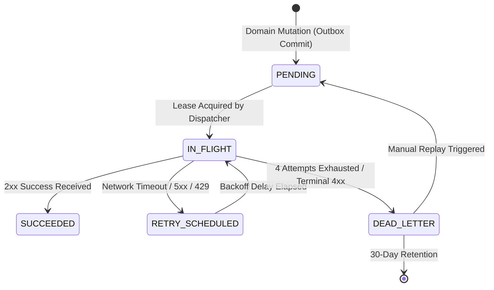

# Webhooks & REST API Integration Guide (FR-016 & FR-017)

This comprehensive guide covers the architecture, configuration, security, and developer usage of the **REST API (`/api/v1`, `/api/v2`)** and **Asynchronous Webhook Engine** in graphsign.ink.

---

## 🏛️ System Architecture

```mermaid
flowchart TD
    subgraph External["Client Systems & Integrations"]
        CRM["CRM / ERP / Custom Backend"]
        HookReceiver["Webhook Receiver Endpoint"]
    end

    subgraph REST_API["graphsign.ink REST API (FR-016)"]
        AuthLayer["OAuth2 & JWT Principal Auth"]
        RateLimiter["Durable Rate Limiter (Sliding Window)"]
        Idempotency["Idempotency Engine (Lease Lock)"]
        DocController["Document Controller (/api/v1/documents)"]
        WebhookController["Webhook Management (/api/v1/webhooks)"]
        RedactedLogs["Redacted Request Logger"]
    end

    subgraph Core_Services["Service & Domain Layer"]
        AgreementSvc["Agreement Service"]
        Outbox["DomainEvent Outbox"]
        AuditSvc["Hash-Chained Audit Service"]
    end

    subgraph Webhook_Pipeline["Webhook Engine (FR-017)"]
        Dispatcher["Webhook Dispatcher"]
        ASTFilter["JSON AST Rule Filter"]
        Projection["Payload Projection & Privacy"]
        HMACSigner["HMAC-SHA256 Signer"]
        SafeTransport["SafeWebhookTransport (SSRF Guard)"]
        RetryEngine["Retry Engine (Exponential Backoff)"]
        DLQ["Dead Letter Queue (30-day Retention)"]
    end

    CRM -->|POST /documents (with Idempotency-Key)| AuthLayer
    AuthLayer --> RateLimiter --> Idempotency --> DocController
    DocController --> AgreementSvc
    AgreementSvc --> Outbox
    AgreementSvc --> AuditSvc
    DocController --> RedactedLogs

    Outbox --> Dispatcher
    Dispatcher --> ASTFilter
    ASTFilter --> Projection
    Projection --> HMACSigner
    HMACSigner --> SafeTransport
    SafeTransport -->|POST Payload + X-Signature| HookReceiver
    SafeTransport -.->|Failure / Timeout| RetryEngine
    RetryEngine -->|4 Attempts Exhausted| DLQ
    WebhookController -->|Replay Delivery| Dispatcher
```

---

## 📡 REST API Implementation (FR-016 / INK-25)

The REST API exposes graphsign.ink core capabilities to external backends, microservices, and scripts.

### 1. Base URL & Versioning

- **Base URL (Local)**: `http://localhost:8787/api/v1`
- **Base URL (Production)**: `https://api.graphsign.ink/api/v1`
- **Supported Versions**: `/api/v1`, `/api/v2`
- **Default Routing**: Requests to `/api/documents` automatically route to `/api/v1/documents` without redirect penalty.
- **Unsupported Version Guard**: Requests to unknown versions (e.g. `/api/v3/...`) return a structured `404` JSON payload (`VERSION_NOT_SUPPORTED`) rather than generic HTML.

### 2. Authentication & Machine Clients (INK-148)

Two authentication modes are supported:

1. **User JWT Session**: Bearer token acquired via `/api/v1/auth/login`.
2. **Machine-to-Machine OAuth2**: Bound via `ApiClientBinding`. Integrations configure trusted OAuth2 Client IDs (e.g., from Zitadel) and receive scoped access:

```http
Authorization: Bearer <oauth2-or-jwt-access-token>
Content-Type: application/json
```

#### Available API Scopes

| Scope                | Description                                                      |
| :------------------- | :--------------------------------------------------------------- |
| `documents:read`     | Read document metadata, listings, and download files             |
| `documents:create`   | Create new documents from Markdown or PDF binaries               |
| `documents:update`   | Update draft metadata, title, and editable content               |
| `documents:delete`   | Soft-delete agreements within the organization                   |
| `webhooks:read`      | Inspect webhook subscriptions, metrics, and DLQ                  |
| `webhooks:manage`    | Create, update, rotate secrets, and delete webhook subscriptions |
| `webhooks:replay`    | Manually re-trigger failed dead-lettered deliveries              |
| `api_clients:manage` | Manage trusted OAuth2 machine client bindings                    |

### 3. Idempotent Mutation Engine (INK-154)

To prevent duplicate document creation or double-signing when network connections drop, include the `Idempotency-Key` header:

```http
POST /api/v1/documents HTTP/1.1
Idempotency-Key: 9b1deb4d-3b7d-4bad-9bdd-2b0d7b3dcb6d
Content-Type: application/json

{
  "name": "Service-Agreement.pdf",
  "content": "...",
  "contentEncoding": "base64",
  "mimeType": "application/pdf"
}
```

- **First Request**: Returns `201 Created` and caches the response.
- **Network Retry (Identical Payload)**: Returns `200 OK` with cached response and `Idempotency-Replayed: true` header.
- **Payload Mismatch (Same Key, Different Payload)**: Returns `409 Conflict` (`IDEMPOTENCY_MISMATCH`).
- **Concurrent Requests**: Returns `409 Conflict` (`IDEMPOTENCY_IN_PROGRESS`) with `Retry-After`.

### 4. Durable Sliding-Window Rate Limiting (INK-149)

Shared across distributed worker instances via PostgreSQL:

- **Default Quotas**: 100 requests/minute for general API, 10/minute for auth endpoints, 5/minute for public signing.
- **Response Headers**:
  - `X-RateLimit-Limit`: Maximum requests per window.
  - `X-RateLimit-Remaining`: Remaining allowance.
  - `X-RateLimit-Reset`: Unix timestamp when quota refreshes.
  - `Retry-After`: Seconds to wait if `429 Too Many Requests` is returned.

### 5. Document Management Endpoints

#### Create Document

`POST /api/v1/documents`

```json
{
  "name": "Employment Agreement.md",
  "content": "# Employment Agreement\n\nThis agreement...",
  "contentEncoding": "utf-8",
  "mimeType": "text/markdown",
  "metadata": {
    "folder": "HR",
    "department": "Engineering"
  }
}
```

#### List Documents

`GET /api/v1/documents?status=ACTIVE&limit=20&page=1`
Supports pagination, status filtering (`DRAFT`, `IN_REVIEW`, `SENT`, `COMPLETED`, `ARCHIVED`), and keyword searching.

#### Get Document by ID

`GET /api/v1/documents/:id`

#### Full Update / Replacement

`PUT /api/v1/documents/:id` (Replaces draft representation; protects against stale writes with optimistic revision checks).

#### Soft Delete

`DELETE /api/v1/documents/:id` (Soft-deletes agreement and emits `document.deleted` webhook event).

#### Download Document Binary

`GET /api/v1/documents/:id/file`

#### Submit Electronic Signature

`POST /api/v1/documents/:id/sign`

### 6. Searchable Redacted Request Logs (INK-152)

Inspect operational API calls without exposing customer credentials, private keys, or document bytes:

- `GET /api/v1/organisations/me/api-logs`
- Filters: `routeTemplate`, `status`, `userId`, `from`, `to`, `limit`.

### 7. Interactive OpenAPI Docs (INK-146)

- **Interactive UI**: `http://localhost:8787/api/v1/docs` (Powered by Scalar)
- **OpenAPI 3.1 Spec**: `http://localhost:8787/api/v1/openapi.json`

---

## 🔔 Webhook Engine Implementation (FR-017 / INK-26)

The webhook engine provides push-based, real-time event notifications with enterprise security, automatic retries, and data privacy controls.

### 1. Supported Event Catalogue (INK-156)

All events follow the canonical `document.*` and `user.*` namespace:

| Event Name           | Trigger Moment                                         | Sample Use Case                      |
| :------------------- | :----------------------------------------------------- | :----------------------------------- |
| `document.created`   | New document created from upload, scratch, or template | Initialize external CRM record       |
| `document.updated`   | Draft content or metadata updated                      | Sync audit systems                   |
| `document.deleted`   | Document soft-deleted                                  | Archive or remove external reference |
| `document.sent`      | Document dispatched to recipients for signature        | Notify account executive             |
| `document.viewed`    | Recipient opens the signing link for the first time    | Display "Viewed" badge in CRM        |
| `document.signed`    | Individual recipient submits their signature           | Update progress tracker              |
| `document.completed` | All parties signed; PAdES seal applied                 | Trigger billing / auto-provisioning  |
| `document.declined`  | Recipient explicitly declines to sign                  | Notify legal / sales team            |
| `document.voided`    | Sender cancels active signing envelope                 | Unlock assets or cancel workflow     |
| `document.expired`   | Signing deadline passes without completion             | Trigger re-engagement email          |
| `document.verified`  | Document authenticity verified via public portal       | Security compliance audit            |
| `user.created`       | New member joins the organization workspace            | User onboarding workflow             |
| `user.updated`       | Member profile or status changed                       | Sync directory                       |
| `user.role_changed`  | Member permissions promoted or demoted                 | Access governance audit              |
| `user.removed`       | Member removed from organization                       | Revoke external workspace privileges |

Query the dynamic catalogue programmatically:
`GET /api/v1/webhooks/events`

---

### 2. Standard Webhook Payload Envelope

Every webhook HTTP POST delivery contains a standardized JSON envelope:

```json
{
  "id": "e6a71e1c-5d66-4c74-9f44-934d43615170",
  "event": "document.completed",
  "schemaVersion": "1.0",
  "timestamp": "2026-09-17T18:30:00.000Z",
  "organisationId": "018e5b47-6819-7000-8000-000000000001",
  "sequence": 42,
  "test": false,
  "data": {
    "document_id": "018e5b47-7000-7000-8000-000000000002",
    "document_name": "Master Services Agreement.pdf",
    "status": "COMPLETED",
    "folder": "Legal",
    "recipient_id": "018e5b47-8000-7000-8000-000000000003",
    "signer_email": "signer@example.com"
  }
}
```

---

### 3. Cryptographic HMAC-SHA256 Signatures & Dual-Key Rotation (INK-159)

To ensure that received webhooks genuinely originate from graphsign.ink and have not been tampered with or replayed:

#### Outbound HTTP Headers

```http
POST /your-webhook-endpoint HTTP/1.1
Host: api.yourcompany.com
Content-Type: application/json
X-Signature: sha256=d3b07384d113edec49eaa6238ad5ff00 ...
X-Signature-Key-ID: whsec_a1b2c3d4e5f60718
X-Event-ID: e6a71e1c-5d66-4c74-9f44-934d43615170
X-Delivery-ID: 018e5b47-9000-7000-8000-000000000004
X-Attempt-Number: 1
```

#### Secret Generation & Zero-Downtime Rotation

1. When a subscription is created, a unique 256-bit cryptographically secure secret (`whsec_...`) is generated and **shown once**.
2. To rotate secrets without breaking production traffic, call `POST /api/v1/webhooks/:id/rotate-secret`.
3. GraphSign activates the new secret immediately while maintaining a **24-hour verification grace period** for the previous secret.

#### Signature Verification Code Samples

##### Node.js / TypeScript

```typescript
import crypto from 'node:crypto';

export function verifyGraphSignWebhook(
  rawBody: string,
  signatureHeader: string,
  webhookSecret: string,
): boolean {
  const [algo, signature] = signatureHeader.split('=');
  if (algo !== 'sha256' || !signature) return false;

  const expectedSignature = crypto
    .createHmac('sha256', webhookSecret)
    .update(rawBody, 'utf8')
    .digest('hex');

  return crypto.timingSafeEqual(
    Buffer.from(signature, 'hex'),
    Buffer.from(expectedSignature, 'hex'),
  );
}
```

##### Python 3

```python
import hmac
import hashlib

def verify_graphsign_webhook(raw_body: bytes, signature_header: str, secret: str) -> bool:
    try:
        algo, signature = signature_header.split("=")
        if algo != "sha256":
            return False
        expected = hmac.new(secret.encode("utf-8"), raw_body, hashlib.sha256).hexdigest()
        return hmac.compare_digest(signature, expected)
    except Exception:
        return False
```

---

### 4. Enterprise Security & SSRF Defense (`SafeWebhookTransport`) (INK-157)

Outbound webhook deliveries enforce strict network perimeter security:

- **SSRF Prevention**: Automatically blocks URLs resolving to loopback (`127.0.0.1`, `localhost`), link-local (`169.254.x.x`), private subnets (`10.0.0.0/8`, `172.16.0.0/12`, `192.168.0.0/16`), and AWS/GCP cloud metadata instances (`169.254.169.254`).
- **Redirect Rejection**: Rejects HTTP 3xx redirects to prevent redirection attacks into private infrastructure.
- **Port Allowlist**: Only standard ports (80, 443, 8443) are accepted; non-standard or internal ports (e.g. 22, 5432, 6379) are rejected at configuration time.
- **Custom Header Encryption**: Custom headers configured by users (e.g. `X-Custom-Auth`) are stored encrypted at rest.

---

### 5. Delivery Pipeline: Outbox, Retries & Dead Letter Queue (INK-158, INK-161)



1. **Transactional Outbox**: Events are committed in the same database transaction as the business operation, guaranteeing zero lost events.
2. **Retry Strategy**: 1 initial attempt + 3 retries (total 4 attempts) with exponential backoff:
   - Attempt 1: Immediate
   - Attempt 2: +1s (+ jitter)
   - Attempt 3: +2s (+ jitter)
   - Attempt 4: +4s (+ jitter)
   - Honors `Retry-After` headers returned by receivers responding with HTTP 429 or 503.
3. **Dead-Letter Queue (DLQ)**:
   - Deliveries that fail all 4 attempts are moved to the DLQ (`WebhookDeadLetter`).
   - Retained for **30 days**.
   - Inspect DLQ items: `GET /api/v1/webhooks/:id/dead-letters`
   - Replay failed delivery: `POST /api/v1/webhooks/deliveries/:id/replay`

---

### 6. Event Filtering via JSON AST Rules (INK-162)

Subscriptions can filter events before delivery using JSON abstract syntax trees so that webhooks fire only for relevant agreements:

```json
{
  "and": [
    { "field": "folder", "op": "eq", "value": "Enterprise" },
    { "field": "status", "op": "in", "value": ["COMPLETED", "SIGNED"] }
  ]
}
```

- Supported operators: `eq`, `neq`, `in`, `contains`, `exists`.
- Evaluated against canonical event snapshot before network transmission; non-matching events consume zero outbound HTTP capacity.

---

### 7. Payload Projection & Privacy Controls (INK-164)

Subscribers can tailor the fields delivered in the `data` block to adhere to data minimization principles:

- **`ALL` Mode**: Includes all standard fields for the event.
- **`CUSTOM` Mode**: Specify exact fields in `includeFields`, for example `["document_id", "document_name", "status"]` while omitting PII such as `signer_email`.

---

### 8. Outbound Rate Limiting (INK-160)

- Configure `rateLimitPerMinute` per webhook subscription (1 to 1000 requests/minute, default: 10).
- When outbound volume exceeds the quota, deliveries are rescheduled (`RATE_LIMITED` status) without consuming retry attempt budgets, shielding client servers from traffic spikes.

---

### 9. Developer Testing & Monitoring Tools (INK-163, INK-165)

#### Dispatch Synthetic Test Event

Verify your receiver without creating dummy agreements:
`POST /api/v1/webhooks/:id/test`

```json
{
  "eventType": "document.completed",
  "dataOverrides": {
    "document_name": "Test Run Verification.pdf"
  }
}
```

Returns execution latency, response status code, and raw response snippet immediately.

#### Aggregated Performance Metrics & CSV Export

- JSON summary: `GET /api/v1/webhooks/:id/metrics?period=24h`
- CSV export: `GET /api/v1/webhooks/:id/metrics?format=csv`

---

## 💻 Web Management Console (`/settings/integrations`)

Manage your integrations visually from the GraphSign web application:

1. Navigate to **Settings** $\rightarrow$ **Integrations & Developer APIs**.
2. **Webhooks Tab**:
   - Create new webhook endpoints with event selectors, URL validation, and custom headers.
   - Inspect delivery health, success rates, and average latency.
   - Dispatch synthetic test events directly from the UI.
   - Rotate signing keys with one click.
   - Inspect and replay dead-lettered events.
3. **API Client Bindings Tab**: Register OAuth2 machine credentials and inspect active scopes.
4. **API Request Logs Tab**: Search and review sanitized API invocations.
5. **Interactive Docs Tab**: Browse and execute API requests in the embedded Scalar documentation portal.

---

## 🎯 Value Summary: Why Use Webhooks & REST API?

| Capability                    | Without Webhooks / REST API                                             | With graphsign.ink Webhooks & REST API                                               |
| :---------------------------- | :---------------------------------------------------------------------- | :----------------------------------------------------------------------------------- |
| **Agreement Generation**      | Manual upload and manual form entry via web UI                          | Programmatic creation via simple REST call with Base64 PDF or Markdown               |
| **Status Tracking**           | Continual polling (`GET` every 10s), wasting API quotas and bandwidth   | Instant, push-based Webhook callback the millisecond an event occurs                 |
| **Network Reliability**       | Network timeouts cause duplicate documents or duplicate sign operations | Built-in `Idempotency-Key` lease locking guarantees exactly-once execution           |
| **Delivery Resilience**       | Endpoint failure results in permanently lost notifications              | 4-attempt exponential backoff + 30-day Dead Letter Queue with one-click replay       |
| **Security & Authenticity**   | Unverified HTTP callbacks susceptible to spoofing                       | Cryptographic HMAC-SHA256 signature with dual-key rotation and zero-trust SSRF guard |
| **Data Privacy (GDPR/HIPAA)** | Full agreement payload exposed to third-party logging sinks             | Granular JSON AST filters and payload projection allow masking sensitive PII         |
| **Developer Productivity**    | Guessing request shapes and testing in production                       | Interactive Scalar documentation, test dispatcher, and downloadable CSV metrics      |
