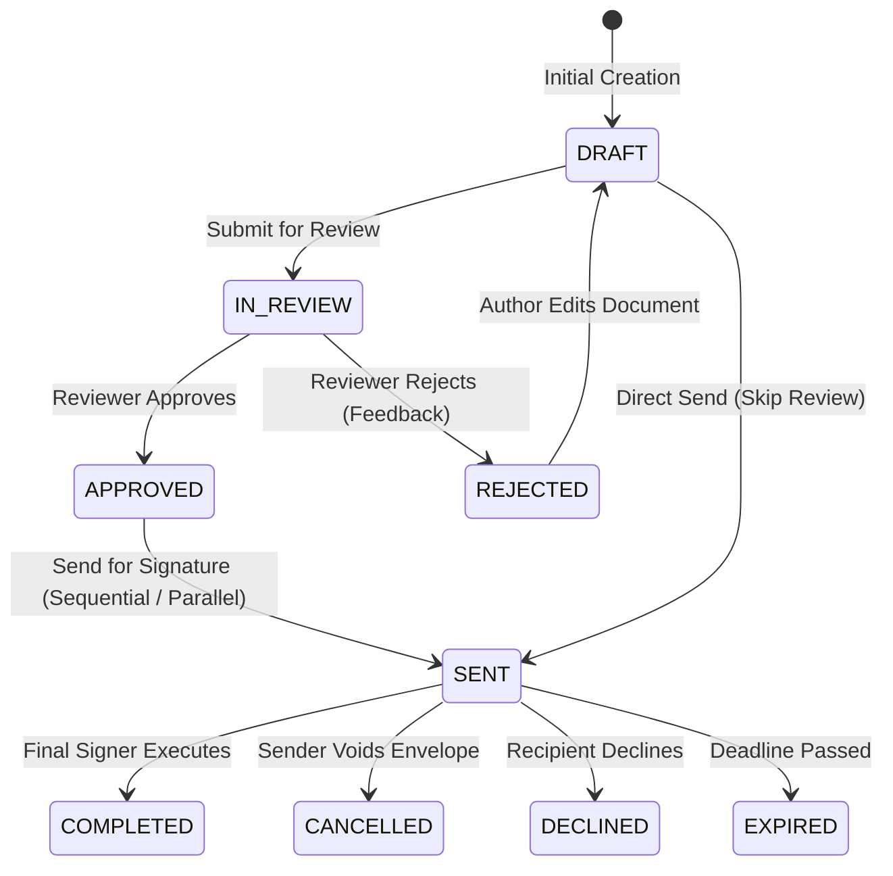

# Workflow Engine & Signer Portal (FR-007)

The **Workflow Engine & Signer Portal** manages the agreement governance process from review and approval through recipient routing, tokenized browser signing, conditional logic evaluation, and completion.

---

## 🔄 State Machine & Agreement Lifecycle

---

## 📋 Key Capabilities

### 1. Internal Review & Approval (INK-87, INK-88, INK-89)

- **Submit for Review**: The author assigns an internal reviewer within the organization with optional instructions.
- **Review Decision**:
  - **Approve**: Agreement transitions to `APPROVED` and sends notification to the author.
  - **Reject**: Agreement transitions to `REJECTED` with mandatory feedback comments so the author can make revisions.

### 2. Send for Signature & Token Security (INK-90)

- Authors configure recipient email, role (`signer`, `approver`, `viewer`), routing order, expiration date, and invitation note.
- **Token Security**: A cryptographically random 256-bit token is generated for each signer. Only the `SHA-256(token)` hash is persisted in the database, ensuring zero plaintext token exposure.

### 3. Sequential vs Parallel Routing (INK-91, INK-92)

- **Parallel Routing (`PARALLEL`)**: All signers are assigned `routingOrder = 1` and receive invitation links simultaneously.
- **Sequential Routing (`SEQUENTIAL`)**: Signers are assigned ordered tiers (`1, 2, 3...`). Only Tier 1 signers receive invitations initially. Once all Tier 1 signers execute, the engine increments `currentStep` and automatically dispatches invitations to Tier 2.

### 4. Viewed Status Tracking (INK-93)

- When a recipient opens the signing link `/sign/[token]`, a view beacon is triggered (`POST /api/v1/sign/:token/view`).
- Status updates from `INVITED` to `VIEWED`, recording the timestamp, IP address, and user-agent.

### 5. Public Signer Portal & Interactive PDF Overlays (INK-94, INK-97 to INK-105)

- Signers do not need an account to sign. Unauthenticated signers can verify their email via Email OTP (`POST /api/v1/sign/:token/otp/send` and `/verify`).
- **Interactive Field Overlay**: Fields assigned to the current signer are highlighted and editable directly on the document canvas:
  - **Signature / Initials**: Single-click to adopt or apply saved drawn/typed signature.
  - **Text, Date, Email, Checkbox, Dropdown**: Native responsive inputs placed at exact percentage coordinates (`x%`, `y%`, `width%`, `height%`).
- **Signature Modes**: Supports **Drawn Signature** (HTML5 touch/mouse canvas with smoothing) and **Typed Signature** (cursive font selection).
- **Electronic Consent**: Signers must check the mandatory ESIGN/eIDAS electronic record and signature disclosure consent (`/consent`).
- **Automatic Cryptographic Sealing**: Upon final signer completion, the workflow transitions to `COMPLETED` and immediately invokes `PadesSealingService.sealAgreement(...)` to stamp the document with PAdES B-T cryptographic signature, RFC 3161 timestamp, and QR verification badge.
- **Completion Receipt**: Displays document title, signer, sender name, envelope UUID, verification token (`GS-xxxxxxxx`), SHA-256 certificate digest, localized timestamp with timezone, and download links.

### 6. Dynamic Conditional Logic Engine (INK-96)

The signer portal evaluates conditional rules in real time:

- **Actions**: `SHOW` (reveal dependent field), `HIDE` (hide field), `REQUIRE` (make mandatory).
- **Conditions**: `EQUALS`, `NOT_EQUALS`, `CONTAINS`, `CHECKED`, `UNCHECKED`.
- **Example**: Checking "Include Tax Exemption" reveals a mandatory "Tax ID" input field.

### 7. Cancellation, Decline & Expiration (INK-95)

- **Void / Cancel**: Authors can void an envelope with a mandatory reason, revoking all active signing tokens.
- **Decline**: Signers can decline to sign with feedback comments.
- **Expiry**: Background cron job auto-expires agreements past their deadline.

---

## 🔌 API Endpoints for Workflow & Signing

### Authenticated Endpoints

| Method | Endpoint                                | Description                     | Permission Required |
| :----- | :-------------------------------------- | :------------------------------ | :------------------ |
| `POST` | `/api/v1/agreements/:id/review/submit`  | Submit agreement for review     | `documents:write`   |
| `POST` | `/api/v1/agreements/:id/review/approve` | Approve agreement               | `documents:write`   |
| `POST` | `/api/v1/agreements/:id/review/reject`  | Reject agreement with feedback  | `documents:write`   |
| `POST` | `/api/v1/agreements/:id/send`           | Send agreement for signature    | `documents:write`   |
| `POST` | `/api/v1/agreements/:id/cancel`         | Void/cancel active envelope     | `documents:write`   |
| `POST` | `/api/v1/agreements/cron/check-expired` | Trigger automated expiry checks | Cron / Admin        |

### Public Signer Endpoints

| Method | Endpoint                         | Description                          | Auth Required |
| :----- | :------------------------------- | :----------------------------------- | :------------ |
| `GET`  | `/api/v1/sign/:token`            | Fetch signing session & fields       | Public Token  |
| `POST` | `/api/v1/sign/:token/consent`    | Record electronic ERSD consent       | Public Token  |
| `POST` | `/api/v1/sign/:token/view`       | Record view event beacon             | Public Token  |
| `POST` | `/api/v1/sign/:token/otp/send`   | Send one-time passcode for guests    | Public Token  |
| `POST` | `/api/v1/sign/:token/otp/verify` | Verify guest signer OTP code         | Public Token  |
| `POST` | `/api/v1/sign/:token/complete`   | Submit signature & completed fields  | Public Token  |
| `POST` | `/api/v1/sign/:token/decline`    | Decline signature with reason        | Public Token  |
| `GET`  | `/api/v1/sign/:token/file`       | Stream PDF or Markdown binary        | Public Token  |
| `GET`  | `/api/v1/sign/:token/download`   | Download executed document with seal | Public Token  |
